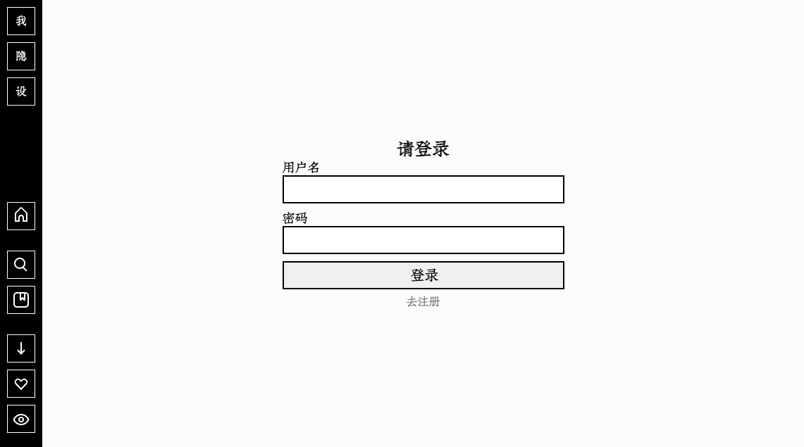
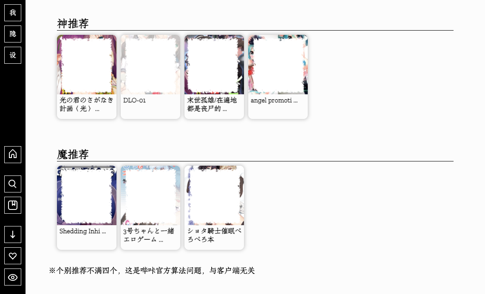
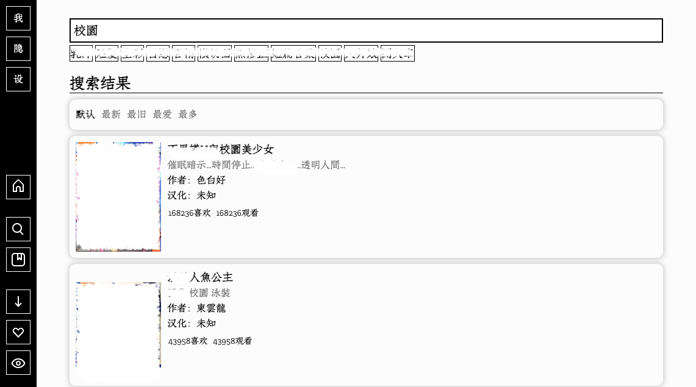
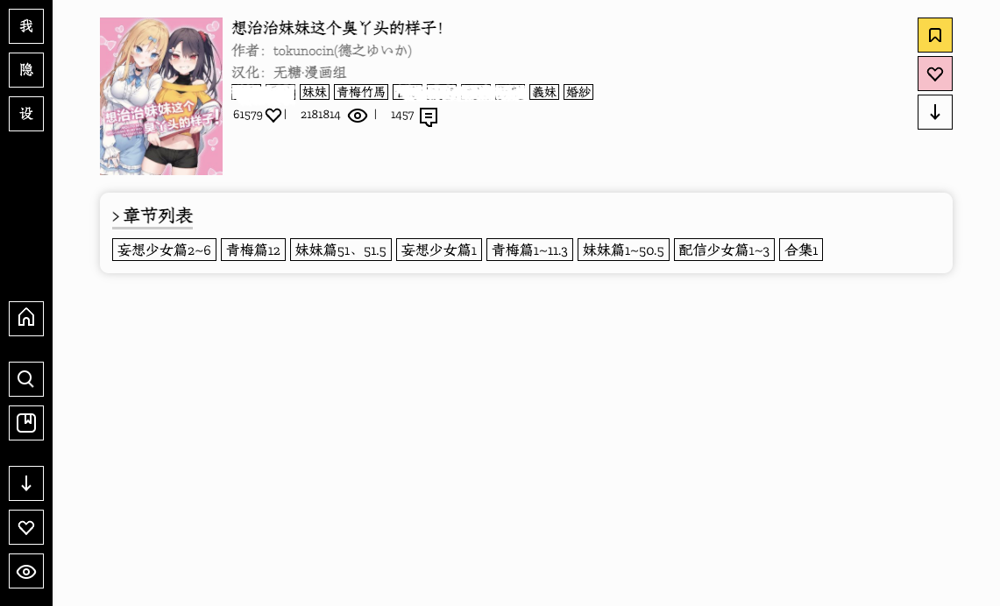
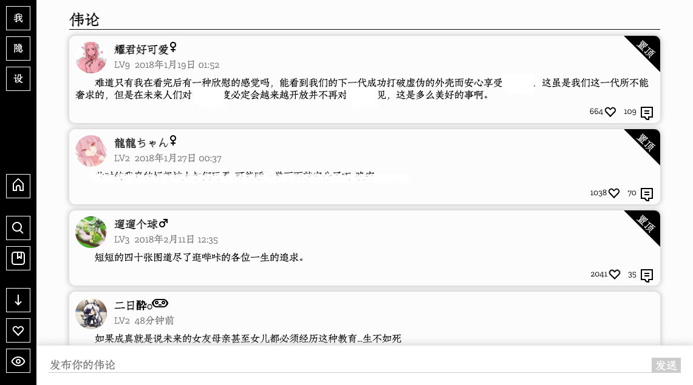
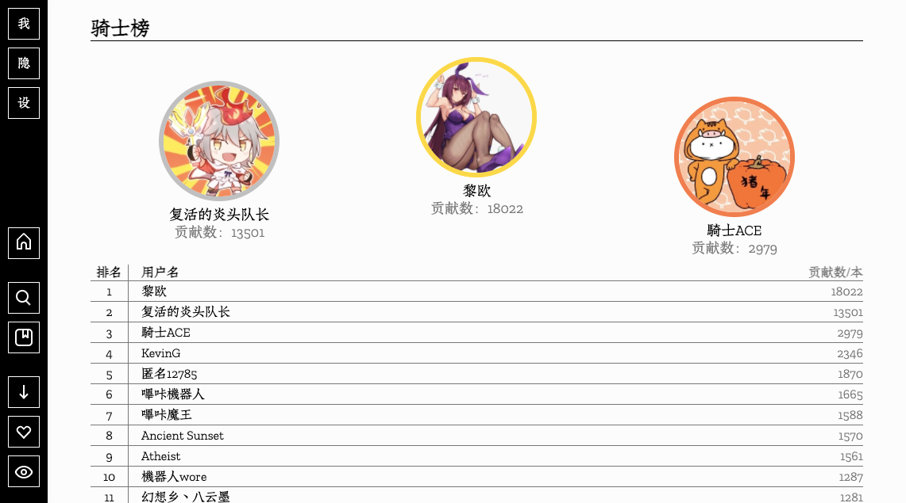
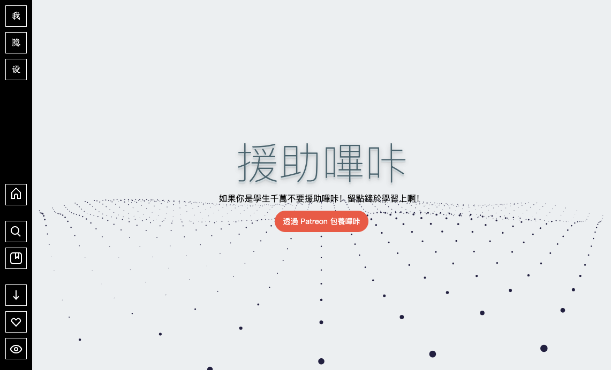

<p align="center"></p>

<h1 align="center">Picable哔咔漫画客户端</h1>

<p align="center">
  <a href="."></a>
  <a href="."></a>
  <a href="."></a><a href="."></a>
</p>

* Picable是哔咔漫画的客户端，旨在让PC（电脑）与移动端（手机）访问哔咔更加便捷，功能更加灵活人性化，为绅士淑女们提供极致的享受。
  
* 目前实现了官方的**绝大部分**功能，还添加了一些**个性化**功能，满足各位的日常需要绰绰有余😏。[功能列表>](#功能列表)

* 当前是**Web**的版本，需要部署。为了更便捷，很快就会推出**桌面版（软件）**。**移动端（手机）** 版本也会很快跟进。希望各位绅士淑女们稍作等待。

**如果各位觉得本项目还不错，请点个star关注，算是对我的最大的鼓励啦。十分感谢。**

>**目录**
>
>[为什么要开发这个](#为什么要开发这个)
>
>[功能列表](#功能列表)
>
>[使用](#使用)
>
>​	[Web（浏览器使用）](#Web（浏览器使用）)
>
>[预览截图](#预览截图)
>
>[开发者碎碎念](#开发者碎碎念)


## 为什么要开发这个

大约一阵子前，由于懂得都懂的原因，哔咔的ios端官方签名不给用了，需要自签，比较麻烦。再加之早就想用PC端看漫画了（因为屏幕大啊），就写了这个应用。


## 功能列表

* 哔咔官方有的功能它就有
* **黑夜模式**
* **打包下载好的漫画成zip压缩包**
* **快速隐藏页面**
* **收藏作者及汉化组** （非官方功能，本地收藏）
* 更多useful的特性正在飞速更新，有想法可以提issue。


## 使用

<h3 align="center">Web（浏览器使用）</h3>

> 注：Linux或OSX用户使用终端运行命令，Windows请使用PowerShell而非cmd。
>
> 以下教程是写给广大群众看的。如果您是开发者，您完全可以尝试分别构建及部署。这是一个**前后端分离**的应用，结构清晰。

**准备工作：**

1.下载Node.js。

进入[Node官网](https://nodejs.org/zh-cn/)下载您系统的Node环境（推荐稳定的版本）并安装。**这是接下来的必要准备。**

2.在命令行中依次运行如下两行命令。

```sh
node -v
npm -v
```

如果输出了版本号，说明你安装成功了。祝贺你。

3.切换npm镜像。

```sh
npm config set registry https://registry.npm.taobao.org
```

**开始部署：**

1.克隆（或下载）本项目

```sh
# 标准的克隆方式
git clone https://github.com/HomeArchbishop/pica-comic.git
# 快速的克隆方式（镜像）
git clone https://hub.fastgit.org/HomeArchbishop/pica-comic.git
# 标准链接下载
https://github.com/HomeArchbishop/pica-comic/archive/refs/heads/main.zip
# 快速的链接下载（镜像）
https://hub.fastgit.org/HomeArchbishop/pica-comic/archive/refs/heads/main.zip
```

2.进入到pica-comic文件夹（如果下载的zip请先解压）

```sh
cd path/to/pica-comic # 将此命令cd后的路径改成下载的文件夹的路径
```

3.安装依赖

```sh
npm run install:web
```

4.构建客户端（这一步请稍等一两分钟，多点耐心，感谢）

```sh
npm run build:web
```

5.最后一步，启动！

```sh
npm run start:web
```

等待10秒左右，运行成功后用浏览器打开[localhost:1210](localhost:1210)，**Enjoy！**

注：如果想要停止服务，请运行如下命令

```sh
npm run stop:web
```

<h3 align="center">桌面版（软件）</h3>

- 待发布...


## 预览截图

| 登录         |  |
| ------------ | :----------------------------------------------------------: |
| 主页         |  |
| 搜索         |  |
| 漫画详细信息 |  |
| 评论         |  |
| 应急隐藏     |  |
| 骑士榜       |  |
| 官方援助等   |  |
| 更多页面     |                           .......                            |


## 开发者碎碎念

**感谢大家看到这里。** 作为一个刚起步的开发者，想做点练手的东西，于是LSP的本性驱使我尝试这个idea。才开始项目名就叫pica-comic，非常的朴实，也是为了方便搜索。后来想想换个新名，那就叫Picable好了。`Picable = Pica + able`，也就是希望让这个项目变得越来越able。那么至于为什么不叫Pica+capable=Picapable呢，因为Picapable这个名字太长，会让人觉得不知所云（笑）。

**我把这个项目发出来，希望大家能够喜欢。不足之处万望赐教。** 如果Star一下当然更好啦，一个Star能够让我兴奋好久😚。

